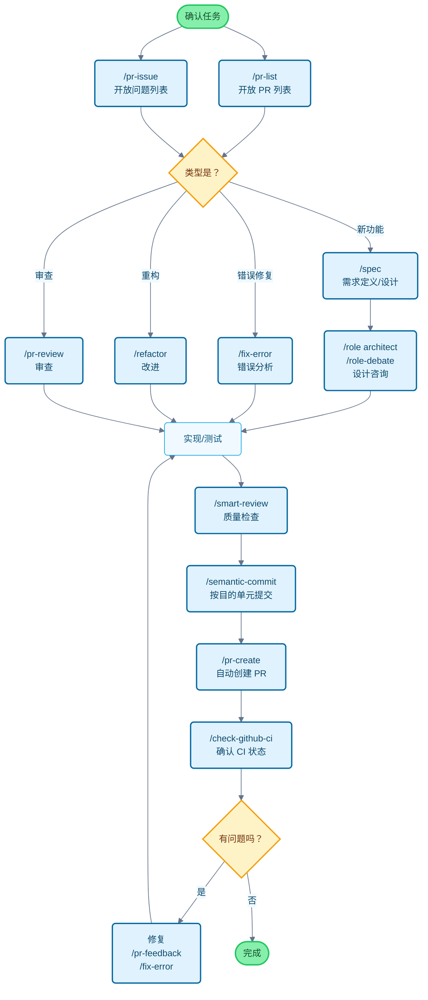

# Claude Code Cookbook

这是一份让 Claude Code 更方便使用的配置集。

它会自动处理繁琐的确认工作，让您能专注于真正想做的事情。
代码修改、测试执行、文档更新等常见任务，Claude Code 会自行判断并执行。

## 主要功能

您可以通过 3 种功能来自定义 Claude Code 的行为。

- **Commands**: 以 `/` 开头的自定义命令
- **Roles**: 为获得专家视角的回答而设定的角色
- **Hooks**: 在特定时机自动执行的脚本

---

## 功能列表

### Commands（自定义命令）

作为 Markdown 文件保存在 `/commands` 目录中。在 `/` 后输入文件名即可执行。

| 命令 | 说明 |
| :--- | :--- |
| `/analyze-dependencies` | 分析项目的依赖关系，并将循环依赖和结构性问题可视化。 |
| `/analyze-performance` | 分析应用程序的性能问题，并从技术债务的角度提出改进建议。 |
| `/check-fact` | 参考项目内的代码库和文档，确认所提供信息的准确性。 |
| `/check-github-ci` | 监控 GitHub Actions 的 CI 状态，并跟踪至完成。 |
| `/check-prompt` | 审查当前提示的内容，并提出改进建议。 |
| `/commit-message` | 仅根据变更内容生成提交信息。 |
| `/context7` | 使用 Context7 MCP 进行上下文管理。 |
| `/design-patterns` | 提出并审查基于设计模式的实现。 |
| `/explain-code` | 浅显易懂地解释所选代码的功能和逻辑。 |
| `/fix-error` | 根据错误消息，提出代码修复建议。 |
| `/multi-role` | 组合多个角色（Role），并行分析同一对象并生成综合报告。 |
| `/plan` | 启动实施前的计划制定模式，制定详细的实施策略。 |
| `/pr-auto-update` | 自动更新 Pull Request 的内容（描述、标签）。 |
| `/pr-create` | 通过基于 Git 变更分析的自动 PR 创建，实现高效的 Pull Request 工作流。 |
| `/pr-feedback` | 高效处理 Pull Request 的审查评论，并通过三阶段错误分析法从根本上解决问题。 |
| `/pr-issue` | 按优先级显示当前仓库的开放问题列表。 |
| `/pr-list` | 按优先级显示当前仓库的开放 PR 列表。 |
| `/pr-review` | 通过对 Pull Request 的系统性审查，确保代码质量和架构的健全性。 |
| `/refactor` | 安全、分阶段地进行代码重构，并评估 SOLID 原则的遵守情况。 |
| `/role-debate` | 让多个角色（Role）就特定主题进行辩论。 |
| `/role-help` | 显示可用角色（Role）的列表和说明。 |
| `/role` | 作为指定的角色（Role）行动。 |
| `/screenshot` | 截取并分析屏幕截图 |
| `/search-gemini` | 使用 Gemini 进行 Web 搜索。 |
| `/semantic-commit` | 将大的变更分解为有意义的最小单元，并使用语义化的提交信息依次提交。 |
| `/sequential-thinking` | 使用 Sequential Thinking MCP，按部就班地思考复杂问题，并得出结论。 |
| `/show-plan` | 显示当前的执行计划。 |
| `/smart-review` | 进行高级审查，提高代码质量。 |
| `/spec` | 根据需求，分阶段创建符合 Kiro 的 spec-driven development 的详细规格书。 |
| `/style-ai-writting` | 检测并修正由 AI 生成的不自然的文章。 |
| `/task` | 启动专用代理，自主执行复杂的搜索、调查和分析任务。 |
| `/tech-debt` | 分析项目的技术债务，并创建优先级的改进计划。 |
| `/ultrathink` | 针对复杂课题或重要决策，执行分阶段、结构化的思考过程。 |
| `/update-dart-doc` | 系统地管理 Dart 文件的 DartDoc 注释，以维护高质量的中文文档。 |
| `/update-doc-string` | 统一管理和更新多语言的文档字符串。 |
| `/update-flutter-deps` | 安全地更新 Flutter 项目的依赖项。 |
| `/update-node-deps` | 安全地更新 Node.js 项目的依赖项。 |
| `/update-rust-deps` | 安全地更新 Rust 项目的依赖项。 |

### Roles（角色设定）

在 `agents/roles/` 目录中的 Markdown 文件中定义。让 Claude 拥有专家视角，从而获得更准确的回答。

每个角色也可以**作为子代理独立执行**。使用 `--agent` 选项，可以在不干扰主对话上下文的情况下，并行执行大规模分析或专业处理。

| 角色 | 说明 |
| :--- | :--- |
| `/role analyzer` | 作为系统分析专家，对代码和架构进行分析。 |
| `/role architect` | 作为软件架构师，对设计进行审查和建议。 |
| `/role frontend` | 作为前端专家，就 UI/UX 和性能提供建议。 |
| `/role mobile` | 作为移动应用开发专家，根据 iOS/Android 的最佳实践进行回答。 |
| `/role performance` | 作为性能优化专家，提出速度和内存使用方面的改进建议。 |
| `/role qa` | 作为 QA 工程师，从测试计划和质量保证的角度进行审查。 |
| `/role reviewer` | 作为代码审查员，从可读性和可维护性的角度评估代码。 |
| `/role security` | 作为安全专家，指出漏洞和安全风险。 |

#### 子代理执行示例

```bash
# 常规模式（在主上下文中执行）
/role security
“对此项目进行安全检查”

# 子代理模式（在独立上下文中执行）
/role security --agent
“执行整个项目的安全审计”

# 多角色并行分析
/multi-role security,performance --agent
“全面分析整个系统的安全性和性能”
```

### Hooks（自动化脚本）

在 `settings.json` 中进行设置，以自动化开发工作。

| 执行脚本 | 事件 | 说明 |
| :--- | :--- | :--- |
| `deny-check.sh` | `PreToolUse` | 防止执行 `rm -rf /` 等危险命令。 |
| `check-ai-commit.sh` | `PreToolUse` | 在 `git commit` 时，如果提交信息中包含 AI 签名，则报错。 |
| `preserve-file-permissions.sh` | `PreToolUse` / `PostToolUse` | 在编辑文件前保存原始权限，并在编辑后恢复。防止 Claude Code 更改权限。 |
| `ja-space-format.sh` | `PostToolUse` | 在保存文件时，自动格式化中文和英数字之间的空格。 |
| `auto-comment.sh` | `PostToolUse` | 在创建新文件或进行大幅编辑时，提示添加 docstring 或 API 文档。 |
| `notify-waiting` | `Notification` | 当 Claude 等待用户确认时，在 macOS 的通知中心发出通知。 |
| `check-continue.sh` | `Stop` | 任务完成时，检查是否还有可继续的任务。 |
| `(osascript)` | `Stop` | 所有任务完成时，在 macOS 的通知中心通知完成。 |

---

## 开发流程与命令使用指南

### 在一般开发流程中活用命令的示例



---

## 引入与自定义

### 引入步骤

1. **克隆仓库**: `git clone https://github.com/wasabeef/claude-code-cookbook.git ~/.claude`
2. **在客户端中设置路径**: 在 Claude 的客户端中，指定上述目录的路径
3. **确认路径**: 确认 `settings.json` 中的脚本路径与您的环境一致

### 自定义

- **添加命令**: 只需在 `commands/` 中添加 `.md` 文件
- **添加角色**: 只需在 `agents/roles/` 中添加 `.md` 文件
- **编辑 Hooks**: 编辑 `settings.json` 即可更改自动化处理