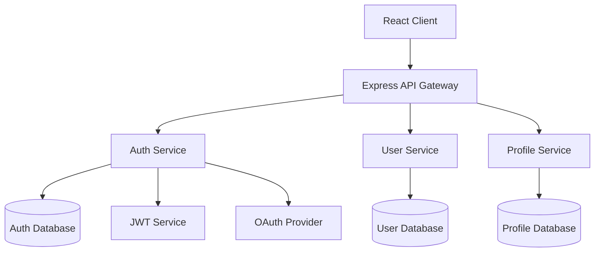

## 规格

**“在编写代码之前提供结构”** - 完全符合 Kiro 的规范驱动开发

与传统的代码生成工具不同，我们实现了 Kiro 的规范驱动开发，重点是为开发的混乱带来结构。从最少的需求输入开始，逐步展开到产品经理级别的详细规范和可实施的设计，确保从**原型到生产环境**的一致质量。

### 使用方法

```bash
# 请求 Claude 进入 Spec 模式（最少需求输入）
“请为 [功能描述] 创建规格”

# Kiro 式分阶段展开：
# 1. 简单需求 → 自动生成详细用户故事
# 2. 使用 EARS 表示法进行结构化需求描述
# 3. 通过分阶段对话完善规范
# 4. 生成 3 个独立文件：
#    - requirements.md：使用 EARS 表示法的需求定义
#    - design.md：包含 Mermaid 图和 TypeScript 接口的设计
#    - tasks.md：自动应用最佳实践的实施计划
```

### 已证实的效果（Kiro 业绩）

**2 天内开发出安全的文件共享应用**

```bash
“请为文件共享系统（支持加密）创建规格”
→ 2 天内完成生产级别的加密文件共享应用程序
→ 自动应用安全最佳实践
→ 无需额外提示
```

**1 个晚上开发出游戏（无经验者）**

```bash
“请为 2D 益智游戏创建规格”
→ 无游戏开发经验的开源开发者
→ 1 个晚上完成游戏创建
→ 实施逻辑由 Kiro 处理，开发者专注于创造性
```

**一个周末从原型到生产**

```bash
“请为电商网站的商品管理系统创建规格”
→ 一个周末从概念到可运行的原型
→ 从原型到生产环境的一致质量
→ 采用规范驱动开发的结构化方法
```

### 基本示例

```bash
# 创建新功能的规格（最少输入）
“商品评论系统
- 星级评分功能
- 评论发布
- 图片上传”

# 创建系统功能的规格
“用户认证
- 支持 OAuth
- 多因素认证”

# 创建 API 功能的规格
“支付系统 API
- 集成 Stripe
- 重视安全”
```

### 与 Claude 协作

```bash
# 复杂功能规格
“请为聊天功能创建规格。包括 WebSocket、实时通知、历史记录管理”

# 数据库集成功能规格
“请为电商网站的库存管理功能创建规格。包括商品添加、库存更新、警报功能”

# 前端功能规格
“请为 React 仪表板创建规格。包括图表显示、筛选、导出功能”

# 后端功能规格
“请为 RESTful API 创建规格。包括认证、验证、日志记录”
```

### Spec 模式的特点

**分阶段对话工作流**

- 完全再现 Kiro 的核心价值——分阶段讨论
- 在每个阶段与用户协作完善规范
- 通过解决疑问、讨论选项、审批流程后生成文件

**三阶段对话式展开**

- **阶段 1**：需求发现 → 讨论 → 批准 → 生成 `requirements.md`
- **阶段 2**：设计探索 → 讨论 → 批准 → 生成 `design.md`
- **阶段 3**：实施规划 → 讨论 → 批准 → 生成 `tasks.md`

**动态规范制定**

- 通过对话消除需求模糊性
- 提出并讨论技术选项
- 解释权衡并确认决策

### 详细示例

```bash
# 复杂系统功能
“请为在线支付系统创建规格。包括 Stripe 集成、安全、错误处理”

# 前端功能
“请为 React 组件创建规格。包括状态管理、属性设计、测试”

# 后端功能
“请为 GraphQL API 创建规格。包括模式设计、解析器、认证”

# DevOps 功能
“请为 CI/CD 流水线创建规格。包括测试自动化、部署、监控”
```

### 分阶段对话工作流（逐阶段）

#### 阶段 1：需求发现与讨论

**1. 从最少输入自动扩展（Kiro 式）**

```
用户：“用户管理系统
- 登录功能
- 个人资料编辑
- 管理员权限”

Claude：“将从需求中生成详细的用户故事。
这个理解正确吗？

自动生成的用户故事：
- 用户注册/认证功能（支持 OAuth）
- 个人资料管理功能（头像、设置）
- 权限管理功能（RBAC）
- 密码重置功能
- 安全审计日志

我们补充了未明确说明的细节。还有其他需要的功能吗？”
```

**2. 使用 EARS 表示法进行结构化需求描述**

```
Claude：“使用 Kiro 的 EARS 表示法将需求结构化：

使用 EARS 表示法的需求定义：

WHEN 用户尝试登录时
GIVEN 输入了正确的邮箱地址和密码
THEN 系统将确认认证
AND 成功时重定向到仪表板

WHILE 用户在个人资料编辑屏幕时
THE SYSTEM SHALL 实时执行验证
AND 预览更改内容

WHERE 需要管理员权限的功能
IS 被尝试访问时
THE SYSTEM SHALL 检查权限级别
AND 如果权限不足则拒绝访问”
```

**3. 自动补充边缘案例和安全需求**

```
Claude：“根据 Kiro 的最佳实践，我们还考虑了以下情况：

安全需求（自动补充）：
- 防暴力破解攻击
- 会话管理和超时
- CSRF 保护和 XSS 对策
- 密码强度要求

边缘案例（自动检测）：
- 并发登录限制
- 帐户锁定功能
- 数据迁移时的一致性保证
- 大量请求时的负载均衡

这些需求是否合适？”
```

**5. 阶段 1 完成与批准**

```
Claude：“需求阶段已完成。
是否生成 requirements.md？”
→ “继续”→ 生成 requirements.md
```

#### 阶段 2：设计探索与讨论

**1. 代码库分析 + 自动设计建议（Kiro 式）**

```
Claude：“分析现有代码库，并提出最佳架构：

代码库分析结果：
- 认证：JWT + Express.js (v4.18.x)
- 数据库：PostgreSQL (v14+)
- 前端：React + TypeScript (v18+)
- 现有模式：仓库模式、服务层分离

Kiro 推荐架构：
- 符合整洁架构
- 领域驱动设计元素
- 部分应用 CQRS 模式
- 自动化的安全最佳实践

是否按此设计进行？”
```

**2. 使用 Mermaid 图进行可视化设计**

```
Claude：“已自动生成系统设计的 Mermaid 图：

自动生成的架构图：



是否也生成数据流图？”

```

**3. 自动生成 TypeScript 接口**
```

Claude：“根据设计自动生成 TypeScript 接口：

自动生成的 TypeScript 接口：

```typescript
// Domain entities
interface User {
  readonly id: UserId;
  readonly email: Email;
  readonly profile: UserProfile;
  readonly auth: AuthSettings;
  readonly permissions: Permission[];
  readonly createdAt: Date;
  readonly updatedAt: Date;
}

interface UserProfile {
  readonly displayName: string;
  readonly avatar: AvatarUrl;
  readonly preferences: UserPreferences;
}

interface AuthSettings {
  readonly passwordHash: PasswordHash;
  readonly mfaEnabled: boolean;
  readonly lastLoginAt: Date;
  readonly failedAttempts: number;
}

// Use cases
interface UserRepository {
  findById(id: UserId): Promise<User | null>;
  findByEmail(email: Email): Promise<User | null>;
  save(user: User): Promise<void>;
}

interface AuthenticationService {
  authenticate(credentials: LoginCredentials): Promise<AuthResult>;
  refreshToken(token: RefreshToken): Promise<AccessToken>;
}
```

是否按此接口设计进行？”

```

**4. 阶段 2 完成与批准**
```

Claude：“设计阶段已完成。
是否生成 design.md？”
→ “继续”→ 生成 design.md

```

#### 阶段 3：实施规划与讨论

**1. 自动应用最佳实践（Kiro 式）**
```

Claude：“已生成自动应用 Kiro 最佳实践的实施计划：

自动生成的实施策略：

1. 安全第一的开发
   - 自动集成 OWASP Top 10 对策
   - 自动实现加密/哈希
   - 自动生成安全测试

2. 强制执行整洁架构
   - 自动实现分层
   - 自动应用依赖倒置
   - 强制执行可测试的设计

3. 性能优化
   - 自动实现缓存策略
   - 数据库优化
   - 利用异步处理

是否按此方法进行？”

```

**2. 自动设置质量检查点**
```

Claude：“已自动为每个实施阶段设置质量检查点：

自动质量保证流程：

阶段 3a：后端实施

- [ ] 安全扫描 (SAST/DAST)
- [ ] API 规范测试 (符合 OpenAPI)
- [ ] 性能测试 (负载/响应)
- [ ] 漏洞扫描 (依赖项/CVE)

阶段 3b：前端实施

- [ ] 可访问性测试 (WCAG 2.1 AA)
- [ ] 浏览器兼容性测试
- [ ] 响应式设计验证
- [ ] 安全标头确认

阶段 3c：集成/部署

- [ ] E2E 测试套件
- [ ] CI/CD 流水线设置
- [ ] 监控/日志设置
- [ ] 生产环境安全审计

所有这些都将自动执行。是否有其他质量标准？”

```

**3. 自动分析依赖关系和风险缓解**
```

Claude：“已自动分析实施顺序和风险缓解措施：

优化的实施顺序：

第 1 周：基础设施/安全基础

- 数据库设计/模式创建
- 认证基础 (JWT + 会话管理)
- 安全中间件实施
- 基本 API 端点

第 2 周：核心功能实施

- 用户管理功能
- 个人资料管理功能
- 权限管理系统
- 验证/错误处理

第 3 周：高级功能/优化

- 多因素认证实施
- 审计日志功能
- 性能优化
- 前端集成

自动检测到的风险缓解措施：

- 多因素认证：分阶段引入 (短信→应用认证)
- 会话管理：Redis 集群配置
- 大量访问：速率限制 + CDN 利用
- 数据一致性：加强事务管理

这个计划有问题吗？”

```

**4. 阶段 3 完成与批准**
```

Claude：“实施规划阶段已完成。
是否生成 tasks.md？”
→ “继续”→ 生成 tasks.md

```

### Kiro 特有功能

**EARS 表示法 (Easy Approach to Requirements Syntax)**
```markdown
# Kiro 标准 EARS 表示法模式

WHEN [情况/触发器]
GIVEN [前提条件]
THEN [系统行为]
AND [附加行为]

WHILE [状态/过程]
THE SYSTEM SHALL [必要行为]
AND [相关行为]

WHERE [功能/组件]
IS [条件/状态]
THE SYSTEM SHALL [相应行为]
```

**自动生成功能**

- **Mermaid 图**：自动生成架构/数据流图
- **TypeScript 接口**：根据设计自动创建类型定义
- **最佳实践**：自动集成安全/性能对策
- **质量检查点**：自动设置分阶段质量标准

**hooks 集成**

- 文件保存时自动进行质量检查
- 自动应用代码标准
- 自动执行安全扫描
- 自动验证 OWASP Top 10 对策

**原型→生产质量保证**

- 通过结构化方法实现一致的设计
- 强制执行安全第一的开发
- 自动应用可扩展架构
- 集成持续质量管理

### 注意事项

**适用范围**

- Spec 模式最适合功能实施
- 对于简单的修复或小规模更改，请使用常规实施方式
- 推荐用于新功能开发或复杂功能改造

**质量保证**

- 明确每个阶段的完成标准
- 实施前的设计审查
- 包括测试和可访问性的全面质量标准

**执行注意事项**

- 在进入设计阶段之前消除需求模糊性
- 设计完成后生成实施任务
- 重视每个阶段的批准流程

### 触发短语和控制

#### 分阶段工作流控制

**开始触发器**

- “请为 [功能名称] 创建规格”
- “我想用规范驱动的方式开发 [功能名称]”
- “请从规格书设计 [功能名称]”

**阶段进展控制**

- **“继续”**：完成当前阶段，生成文件，并进入下一阶段
- **“修改”**：在当前阶段内调整/改进内容
- **“重做”**：从头开始当前阶段
- **“详细说明”**：提供更详细的说明或选项
- **“跳过”**：跳过当前阶段进入下一阶段（不推荐）

**文件生成时机**

```
阶段 1 完成 → “继续” → 生成 requirements.md
阶段 2 完成 → “继续” → 生成 design.md
阶段 3 完成 → “继续” → 生成 tasks.md
```

### 执行示例（分阶段流程）

```bash
# 使用示例
用户：“请为用户管理系统创建规格”

# 阶段 1：需求发现
Claude：[开始确认和讨论需求]
用户：[响应/讨论/修改]
Claude：“需求阶段已完成。是否继续？”
用户：“继续”
→ 生成 requirements.md

# 阶段 2：设计探索
Claude：[开始提出和讨论设计]
用户：[技术选型/架构讨论]
Claude：“设计阶段已完成。是否继续？”
用户：“继续”
→ 生成 design.md

# 阶段 3：实施规划
Claude：[开始讨论实施计划]
用户：[讨论优先级/风险/工时]
Claude：“实施阶段已完成。是否继续？”
用户：“继续”
→ 生成 tasks.md

# 完成
Claude：“规范驱动开发的准备工作已完成。可以开始实施了。”
```

### 与 /plan 的区别

| 特点 | /plan | /spec |
|---|---|---|
| 对象 | 一般实施计划 | 功能规范驱动开发 |
| 输出格式 | 单个计划文档 | 3 个独立文件 (requirements.md, design.md, tasks.md) |
| 需求定义 | 基本需求整理 | 使用 EARS 表示法的详细验收标准 |
| 设计 | 以技术选型为中心 | 基于代码库分析 |
| 实施 | 一般任务分解 | 考虑依赖关系的序列 |
| 质量保证 | 基本测试策略 | 全面质量要求 (测试、可访问性、性能) |
| 同步 | 静态计划 | 动态规格更新 |

### 推荐用例

**推荐使用 spec**

- 新功能开发
- 复杂功能改造
- API 设计
- 数据库设计
- UI/UX 实施

**推荐使用 plan**

- 系统整体设计
- 基础设施建设
- 重构
- 技术选型
- 架构变更